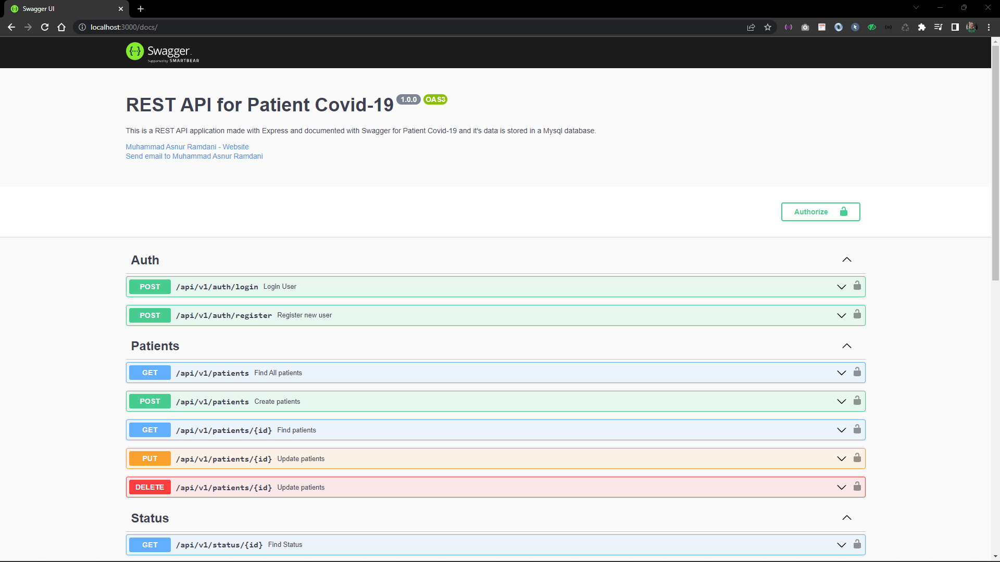
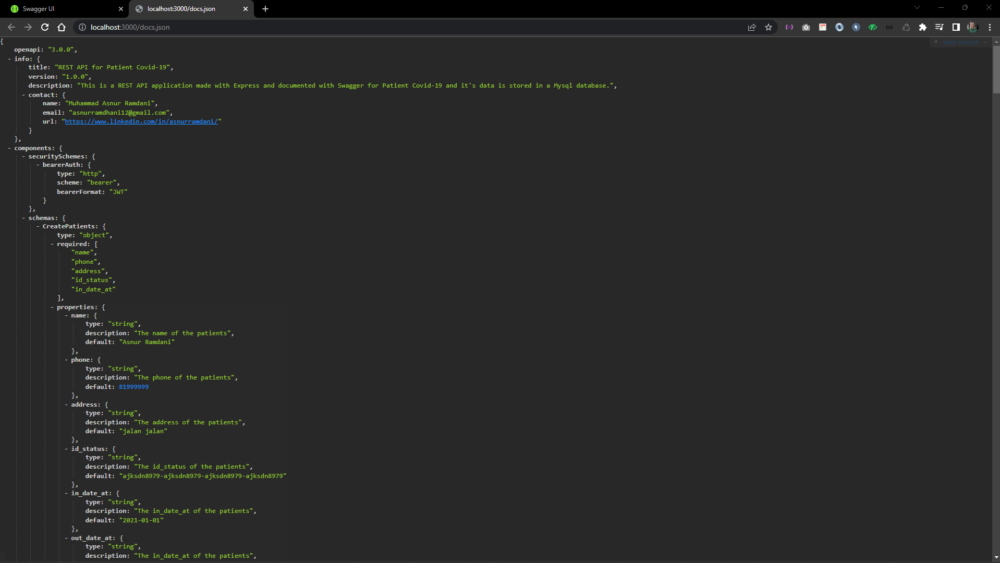
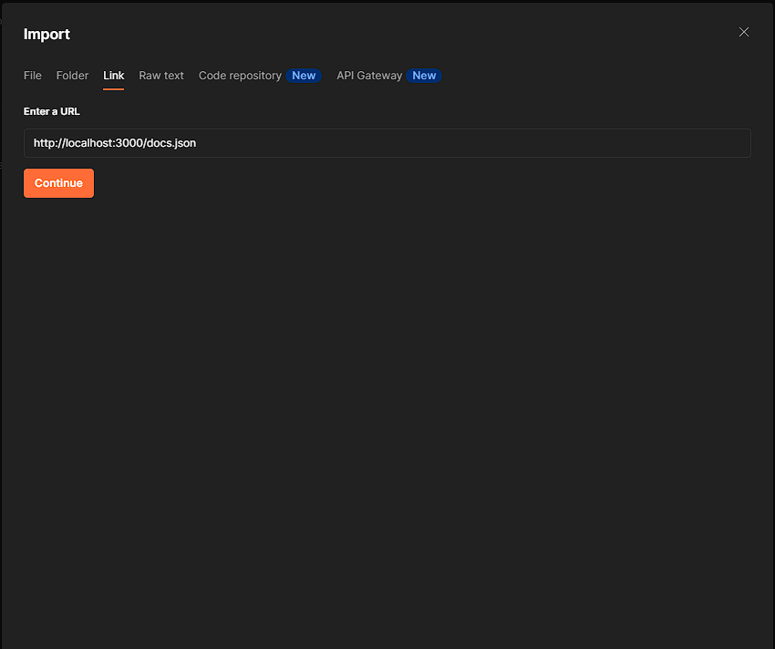
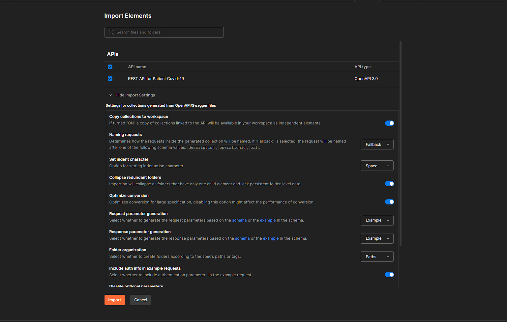
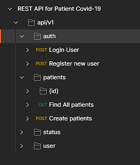

# Express use TypeScript and with MySQL Database with Clean Architecture

## 1. Introduction

### this is a final project for backend course, this project is a simple web api for patients covid19. this project made with :

<!-- Table -->

| Technology   | Description          | reference                                                  |
| :----------- | :------------------- | :--------------------------------------------------------- |
| express      | framework            | [express](https://expressjs.com/)                          |
| typescript   | language             | [typescript](https://www.typescriptlang.org/)              |
| mysql        | database             | [mysql](https://www.mysql.com/)                            |
| docker       | container            | [docker](https://www.docker.com/)                          |
| postman      | testing              | [postman](https://www.postman.com/)                        |
| swagger      | documentation        | [swagger](https://swagger.io/)                             |
| morgan       | logger               | [morgan](https://www.npmjs.com/package/morgan)             |
| jsonwebtoken | authentication       | [jsonwebtoken](https://www.npmjs.com/package/jsonwebtoken) |
| bcrypt       | password hashing     | [bcrypt](https://www.npmjs.com/package/bcrypt)             |
| dotenv       | environment variable | [dotenv](https://www.npmjs.com/package/dotenv)             |

<!--
- express (framework)
- typescript (language)
- mysql (database)
- docker (container)
- postman (testing)
- swagger (documentation)
- morgan (logger)
- jsonwebtoken (authentication)
- bcrypt (password hashing)
- dotenv (environment variable) -->

### this project has 4 main features :

- login and register
- crud patients
- crud status
- crud users

### architecture of this project using Clean Code Architecture. this project has 4 main layers :

- delivery layer
  - controller
  - middleware
  - route
- domain layer
  - entity
  - interface
  - model
- use-case layer
- repository layer

### the diagram of this project :


### structure of this project in src folder :

```
📦src
 ┣ 📂config
 ┃ ┗ 📜database.ts
 ┣ 📂domain
 ┃ ┣ 📂entities
 ┃ ┃ ┣ 📜patients.ts
 ┃ ┃ ┣ 📜response.ts
 ┃ ┃ ┣ 📜status.ts
 ┃ ┃ ┗ 📜user.ts
 ┃ ┣ 📂interface
 ┃ ┃ ┣ 📂repository
 ┃ ┃ ┃ ┣ 📜patients.ts
 ┃ ┃ ┃ ┣ 📜status.ts
 ┃ ┃ ┃ ┗ 📜user.ts
 ┃ ┃ ┗ 📂use-cases
 ┃ ┃ ┃ ┣ 📜patients.ts
 ┃ ┃ ┃ ┣ 📜status.ts
 ┃ ┃ ┃ ┗ 📜user.ts
 ┃ ┗ 📂model
 ┃ ┃ ┣ 📜patients.ts
 ┃ ┃ ┣ 📜status.ts
 ┃ ┃ ┗ 📜user.ts
 ┣ 📂logs
 ┃ ┗ 📜access.log
 ┣ 📂delivery
 ┃ ┣ 📂controller
 ┃ ┃ ┣ 📜auth.ts
 ┃ ┃ ┣ 📜patients.ts
 ┃ ┃ ┣ 📜status.ts
 ┃ ┃ ┗ 📜user.ts
 ┃ ┣ 📂middleware
 ┃ ┃ ┣ 📜jwttoken.ts
 ┃ ┃ ┗ 📜validator.ts
 ┃ ┗ 📂router
 ┃ ┃ ┗ 📜api.ts
 ┣ 📂repository
 ┃ ┣ 📜patients.ts
 ┃ ┣ 📜status.ts
 ┃ ┗ 📜user.ts
 ┣ 📂use-cases
 ┃ ┣ 📜patients.ts
 ┃ ┣ 📜status.ts
 ┃ ┗ 📜user.ts
 ┣ 📂utils
 ┃ ┣ 📜swagger.ts
 ┃ ┗ 📜truncate.ts
 ┗ 📜app.ts
```

## 2. Installation and Run Project

### prerequisite

- nodejs
- npm
- mysql
- postman
- docker (optional)

### Run with docker

- clone this repository
- open terminal and go to project directory
- run `docker-compose up` or `docker-compose up -d` for run in background

```
docker-compose up
docker-compose up -d
```

### Run without docker

- clone this repository
- open terminal and go to project directory
- run `npm install` for install dependencies
- run `npm run build` for build project
- run `npm run start` for run project

```
npm install
npm run build

# for development
npm run start:dev

# for production
npm run start
```

## 3. API Documentation

### api documentation using swagger, you can access this documentation in `http://localhost:3000/docs/` after run project



## 4. Postman Collection

### postman collection for testing this project, you can import this collection in postman from endpoint `http://localhost:3000/docs.json` and import by <b>links</b>



### step by step for import postman collection

1. open postman
2. click button <b>import</b>
3. click <b>link</b>
4. paste endpoint `http://localhost:3000/docs.json`
   
5. click <b>continue</b>
6. make sure <b>Copy collections to workspace</b> is enabled, click <b>import</b>
   
7. collection has been imported<br>
   
